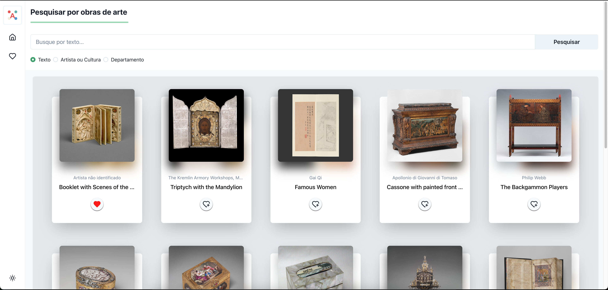
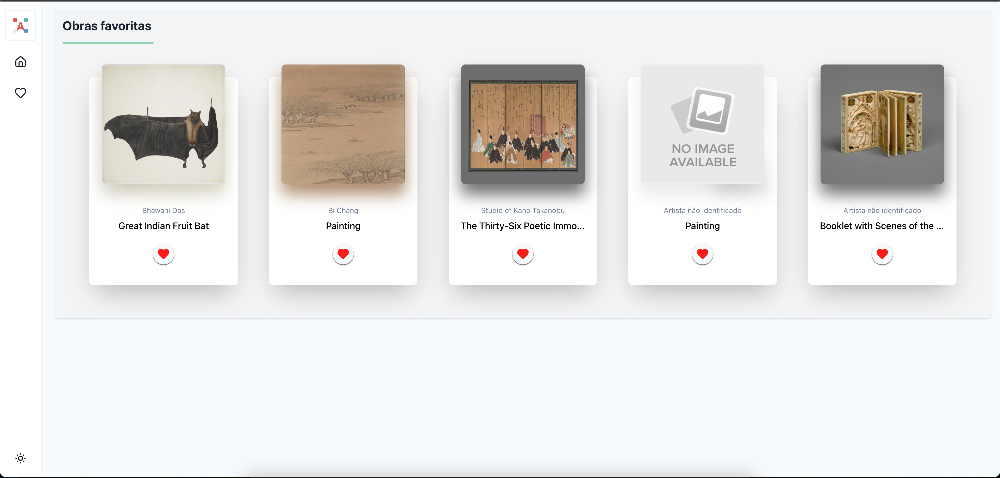
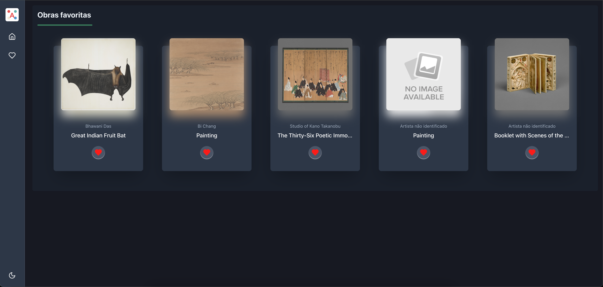

# Art Explorer

## Descrição

Aplicação web responsiva, com o objetivo de explorar obras de arte da coleção do Metropolitan Museum of Art (The Met)

* Buscar obras com imagem
* Visualizar detalhes das obras
* Marcar como favorita
* Listar favoritas
* Filtrar obras por departamento, artista ou cultura e por texto

## Preview

### Home page



### Favorites



### Dark Mode



## Tecnologias

- [React](https://react.dev/)
- [TypeScript](https://www.typescriptlang.org/)
- [TailwindCSS](https://tailwindcss.com/)
- [Chakra UI - v2](https://v2.chakra-ui.com/)
- [Axios](https://axios-http.com/)
- [React Query](https://tanstack.com/query/latest)
- [Zustand](https://zustand-demo.pmnd.rs/)
- [React Hook Form](https://react-hook-form.com/)
- [Zod](https://zod.dev/)
- [Vitest](https://vitest.dev/)
- [Lucide Icons](https://lucide.dev/icons/)

## API do The Met Museum

- [The Met Museum API](https://metmuseum.github.io/)

## Executar o projeto

```bash
Necessário ter o node instalado na versão 18+. Recomendo a LTS que atualmente está na (22.x.x).

# Criar o arquivo ".env":
VITE_APP_NAME= $(nome_de_sua_preferencia)
VITE_APP_BASE_URL=https://collectionapi.metmuseum.org/public/collection/v1
VITE_LOG_LEVEL= $(TRACE || DEBUG || INFO || WARN || ERROR)

# Instalar dependências
pnpm i

# Rodar o projeto
pnpm dev

# Rodar os testes
pnpm test
```
## Observabilidade

### Logger

O projeto implementa logging estruturado e tratamento centralizado de erros, baseado na ideia do Log4j do Java.
Foi criado para que no futuro seja implementado outras ferramentas para production, mantendo sempre a compatibilidade,
usando o conceito de inversão de dependencias do SOLID.

Neste caso temos o console como exemplo, mas pode ser futuramente criado a src/utils/logging/sentry. e implementar a interface logger
garantindo assim o funcionamento para o Sentry sem quebrar a aplicação.
O log é criado no arquivo src/utils/logging/index.ts e nele podem nascer novas implementações para controlar por exemplo qual ferramental escolher em ambientes produtivos.


## Deploy na Vercel:
 - Aplicação está hospedada na vercel: [Link App](https://art-explorer-react-murielrm.vercel.app/)